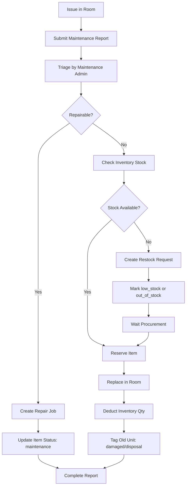

# Inventory Replacement Flow (Room Equipment)

This guide defines the operational flow when an equipment item in a room is damaged and needs replacement from inventory stock.

## 1. End-to-End Business Flow

1. Report issue
- Reporter (staff/faculty) creates a maintenance report.
- Required: room, item name, issue type, description.
- Optional: photo and serial number.

2. Triage report
- Maintenance admin reviews report.
- Decision: repair or replace.
- Set report status to `assigned` then `in_progress`.

3. Check inventory stock
- System checks inventory by item name/type and status `available`.
- If stock exists: continue to reservation.
- If no stock: create restock request and mark as waiting for stock.

4. Reserve replacement item
- Reserve quantity so other jobs cannot consume it.
- Reservation is linked to report ID and room ID.

5. Perform replacement
- Technician replaces defective item in room.
- Old item is tagged `damaged` or `maintenance` for repair/disposal.

6. Post-replacement updates
- Deduct deployed quantity from inventory.
- Add inventory transaction logs (`reserve`, `deploy`, `return`, `dispose`).
- Update room-asset assignment.

7. Complete report
- Add completion notes: replaced item, quantity, technician, date, remarks.
- Set report status to `completed`.

8. Trigger alerts
- If stock <= reorder level: set `low_stock` alert.
- If stock == 0: set `out_of_stock` alert and open procurement action.

## 2. Status Transitions

### 2.1 Report Status
`submitted -> assigned -> in_progress -> completed`

### 2.2 Inventory Movement Status
`available -> reserved -> deployed`

### 2.3 Defective Item Lifecycle
`damaged -> maintenance -> available` (if repaired)
or
`damaged -> disposed`

## 3. Data Model Additions (Checklist)

Current app already has: `maintenance_reports`, `items`, `rooms`, `floors`, `buildings`.

Add these tables:

1. `inventory_transactions`
- `id` (PK)
- `item_id` (FK -> items.id)
- `report_id` (nullable FK -> maintenance_reports.report_id)
- `room_id` (nullable FK -> rooms.id)
- `transaction_type` enum: `reserve|release|deploy|return|adjustment|dispose`
- `quantity` int
- `reference_note` varchar
- `performed_by` (FK -> users.user_id)
- `created_at`

2. `report_inventory_allocations`
- `id` (PK)
- `report_id` (FK)
- `item_id` (FK)
- `room_id` (FK)
- `reserved_qty` int
- `deployed_qty` int
- `status` enum: `reserved|deployed|cancelled`
- `created_by` (FK)
- `created_at`, `updated_at`

3. `restock_requests`
- `id` (PK)
- `item_name` varchar
- `requested_qty` int
- `reason` text
- `source_report_id` (nullable FK)
- `priority` enum: `low|medium|high|urgent`
- `status` enum: `open|approved|ordered|received|cancelled`
- `requested_by` (FK)
- `approved_by` (nullable FK)
- `created_at`, `updated_at`

## 4. API Implementation Checklist

Base path suggestion: `/public/backend/api/inventory-workflow.php`

1. Availability and reservation
- `GET action=availability&item_name=...`
- `POST action=reserve`
- `POST action=release`

2. Deployment and completion
- `POST action=deploy`
- `POST action=return`
- `POST action=dispose`

3. Transaction and audit
- `GET action=transactions&item_id=...`
- `GET action=transactions&report_id=...`

4. Restock
- `POST action=create_restock`
- `GET action=list_restock`
- `POST action=update_restock_status`

## 5. UI Changes by Screen

1. Reports list/detail
- Add button: `Check Inventory`.
- Add panel: `Inventory Allocation`.
- Add actions: `Reserve Item`, `Deploy Replacement`, `Release Reservation`.

2. Inventory page
- Add stock columns:
  - `on_hand`
  - `reserved`
  - `available_to_deploy` (computed)
  - `reorder_level`
- Add quick action: `Create Restock Request`.

3. Room / Building view
- Show currently deployed items per room.
- Show replaced/damaged history.

4. Notifications
- Notify maintenance admin on:
  - low stock
  - out of stock
  - failed reservation
  - restock received

## 6. Validation Rules

1. Reservation cannot exceed available quantity.
2. Deployment cannot exceed reserved quantity for the same report.
3. Only authorized roles can deploy/dispose.
4. Every deploy/return/dispose must write an inventory transaction record.
5. Report can only be `completed` if allocation is either `deployed` or marked `not required`.

## 7. Suggested Rollout Plan

Phase 1 (Core)
1. Add DB tables.
2. Add reserve/deploy/release APIs.
3. Add transaction logging.

Phase 2 (UI)
1. Add allocation widget in report detail.
2. Add inventory stock columns and actions.
3. Add low-stock indicators and filters.

Phase 3 (Governance)
1. Add restock workflow.
2. Add notifications and approval logic.
3. Add audit/export report.

## 8. Acceptance Criteria

1. From a maintenance report, admin can reserve and deploy replacement stock.
2. Inventory quantity updates correctly after deployment.
3. All stock movements are traceable via transaction history.
4. Low-stock and out-of-stock alerts appear reliably.
5. Report completion includes replacement evidence and assigned technician.

## 9. Mermaid Flow Diagram

